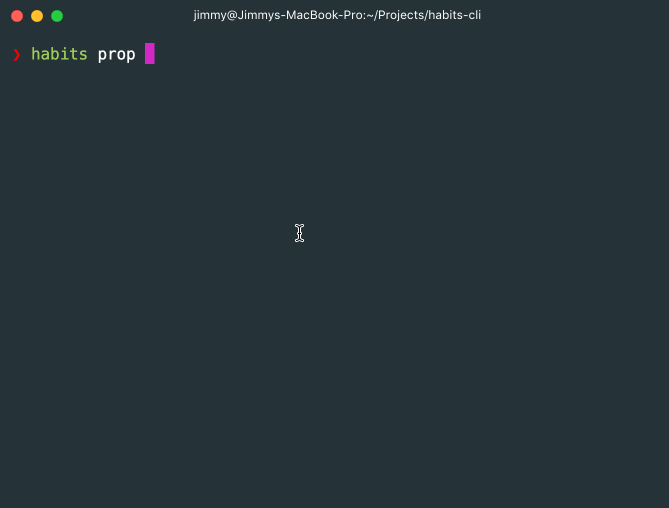
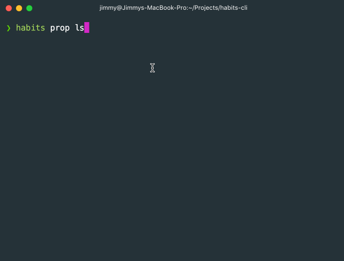
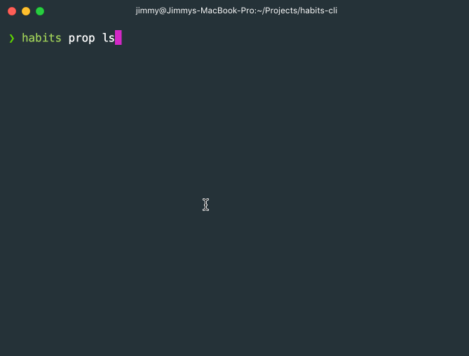
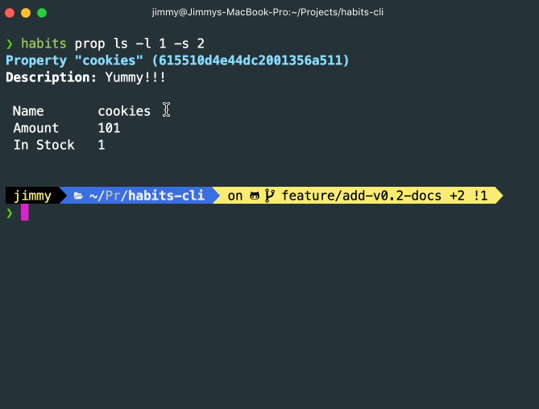
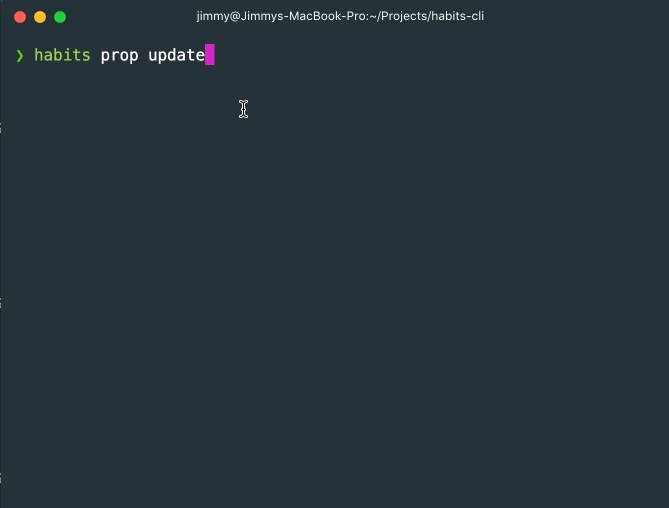

# Feature Demo (Habits CLI v0.2)

> Demo of selected features from Habits CLI v0.2-alpha release.

### Add and view a custom property

### Remove a custom property

### Add a transaction with custom property

### Going over an in-stock limit

## Update a property

