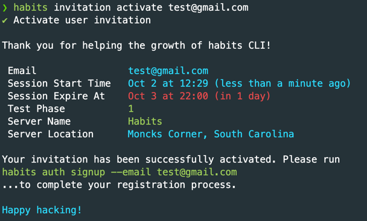

# Using Habits CLI - Quick Start Guide

?> Author: Jimmy Lan

---

Installing the Habits CLI: [Installation Guide](installation.md).

## Organization

Commands in the Habits CLI are organized in categories. The general syntax for accessing commands
is `habits <...category> <command_name>`. For example, `habits auth signin` is accessing the `signin` command within the
category named `auth`.

## Help Messages

You can obtain help messages at every level of the habits command. For example, with the command `habits auth signin`,
you can get help messages at level `habits`, `habits auth`, and `habits auth signin`.

To obtain a help message, use the `-h` or `--help` flag. In our example above, you can type `habits -h`
, `habits auth -h`, and `habits auth signin -h`. When you type `habits -h`, a general help message on what you can
specify for the `habits` command will be logged. It will look like the following:

```bash
Usage: habits [options] <habits command>

the habits cli

Arguments:
  habits command  subcommand of habits (choices: "auth",
                  "transaction", "tran", "property", "prop",
                  "invitation")

Options:
  -V, --version   output the version number
  -h, --help      display help for command
```

Note that this is just an example. The help message may change across versions and will evolve as we add more features.
The above is logged during the testing phase of `habits-cli@v0.2.568-alpha`.

In this case, we know what we can specify after `habits` as an argument (listed in "choices" of argument "habits
command"). Note that we have aliases of subcommands. For instance, `transaction` and `tran` are aliases to the same
command. You can see that in the help message of `habits transaction -h`, which contains a line that says:

```bash
Usage: transaction|tran [options] <transaction command>
```

From there, you can also get a help message for the `habits auth` subcommand (or category, whichever name you'd prefer).
It looks like the following as of `v0.2.568-alpha`:

```bash
Usage: auth [options] <auth command>

authentication

Arguments:
  auth command  subcommand of auth (choices: "signin", "login",
                "signup", "signout", "logout")

Options:
  -h, --help    display help for command
```

Finally, if you run `habits auth signin -h`, you can obtain the following message:

```bash
Usage: signin|login [options]

sign in to your habits account

Options:
  -e, --email <email>  email of user
  -h, --help           display help for command
```

This describes a procedure that you can follow to explore and learn about each command in the Habits CLI other than
reading the documentation online.

## Accepting Invitations (Test Server Only)

If you are working with the Habits CLI test server, you need a valid invitation to perform any operations.

If you do not have a valid invitation and would like to participate in the Habits application testing, please add an
issue to this repository and label it **"question"**. Alternatively, you can notify Jimmy.

Once you obtain an invitation, you can run

```bash
habits invitation activate [your_email]
```

to activate the invitation assigned to you. You will see a screen similar to the following:



## Final Words

Thank you for your interest in keeping health habits with the Habits app! Congratulations on taking a step forward to
healthy habits.
